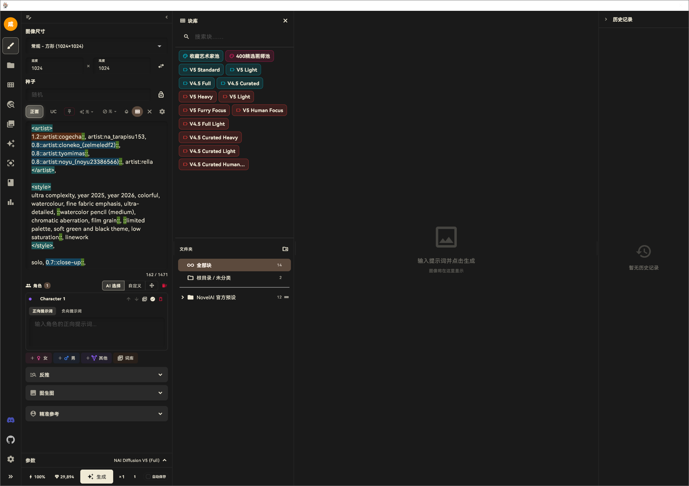
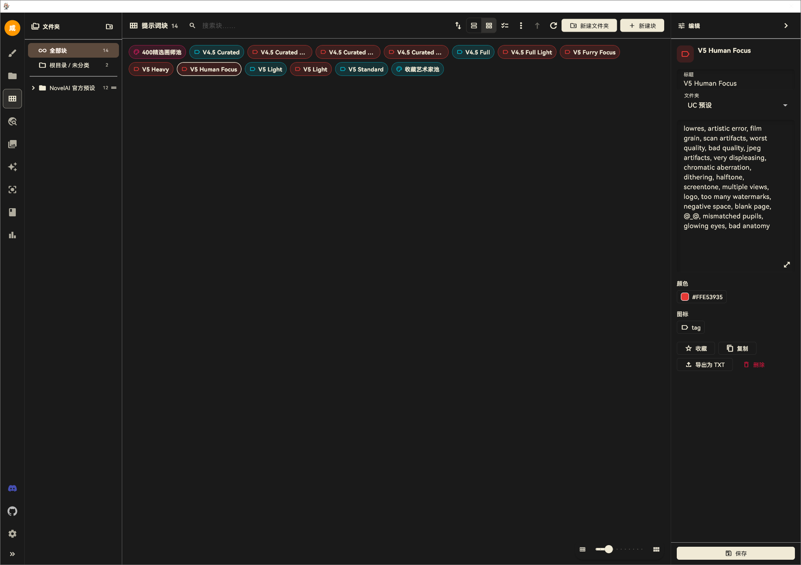
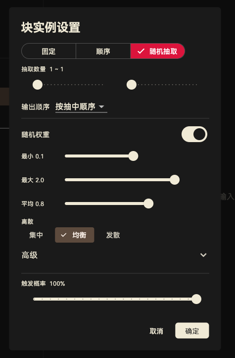
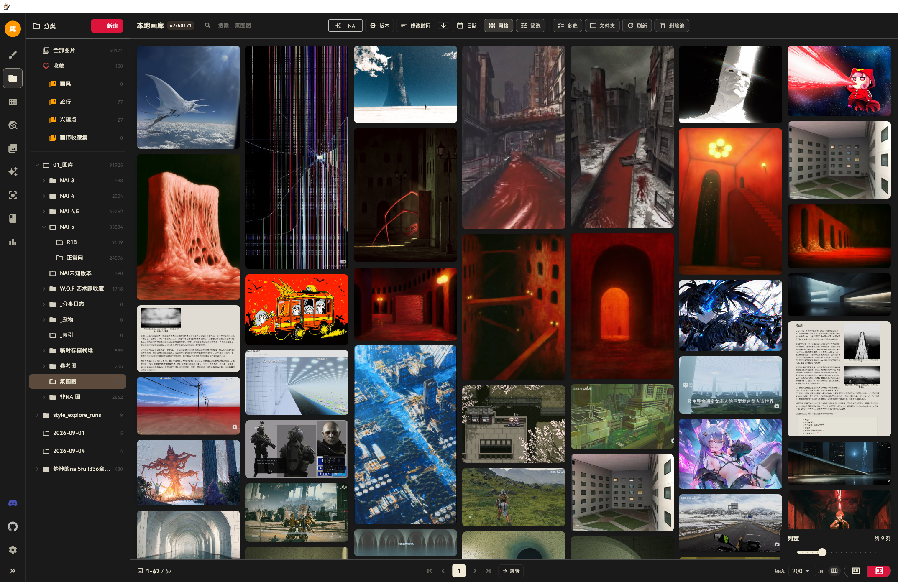

# W.O.F NAI Launcher

<p align="center">
  简体中文 | <a href="README.en-US.md">English</a>
</p>

<p align="center">
  
</p>

<p align="center">
  <strong>面向 NovelAI 图像生成的第三方桌面客户端</strong>
</p>

<p align="center">
  <a href="https://github.com/z15087716457-stack/W.O.F_NAI_Launcher/releases"></a>
  
  
  
</p>

> **本仓库是 [Aaalice233/Aaalice_NAI_Launcher](https://github.com/Aaalice233/Aaalice_NAI_Launcher)（MIT）的个人分支（W.O.F 版）**，功能基线为上游 v1.5.3，版本号从 1.0.0 重新编排。本分支持续维护 V5 模型、桥接填参、画风探索遗传等扩展功能，与上游作者无关，问题反馈请提到本仓库的 Issues。
>
> 画风探索的遗传算法思路参考自 [monineko/PromptCard-Studio](https://github.com/monineko/PromptCard-Studio)（GPL-3.0），本仓库中的实现为 Dart 重写，未复制其源码，详见 [THIRD_PARTY_NOTICES.md](THIRD_PARTY_NOTICES.md)。

NAI Launcher 是一个使用 Flutter 构建的 NovelAI 第三方客户端。它把图像生成、图生图、局部重绘、Vibe / Precise Reference、本地图库、在线图库、生成队列、Krita 联动和统计工具整合在一个桌面应用里，适合日常生成、批量出图和长期管理本地作品。

> 本项目不是 NovelAI 官方产品。使用前请确保你拥有自己的 NovelAI 账号，并遵守 NovelAI 的服务条款。

## ✨ 功能概览

| 能力 | 说明 |
| --- | --- |
| 🎨 图像生成 | 支持 NovelAI Diffusion V1/V2/V3/V4/V4.5/V5（Full / Curated）、Furry 系列、常用采样器、尺寸预设、多角色参数和 Anlas 估算。 |
| 🖼️ 图生图与编辑 | 支持图生图、局部重绘、Focused Inpaint、Outpaint、虚拟画布扩图、硬边蒙版和点击式区域填充。 |
| 🌈 参考与风格 | 支持 Vibe Transfer、Precise Reference、多图参考、Vibe 整包导入导出、PNG 元数据嵌入导出。 |
| ✍️ Prompt 工具 | 内置完整离线 Danbooru/e621 合并标签、别名及 Danbooru 共现关系补全，支持 `Ctrl/⌘+Shift+Space` 查询光标前标签的相关词、固定来源标签后连续选词、Danbooru 在线相关标签补充、可选中文词库与 AI 缺失汉化，以及 NAI/SD 权重语法辅助、Token 统计、提示词框内搜索和固定词；另有贯穿全器的 pill 提示词块系统，见下方特色介绍。 |
| 📚 本地图库 | 支持多图库源递归扫描、默认瀑布流、SQLite 全文搜索、分类/收藏集/删除池、模型版本过滤、元数据解析、批量操作和大图预览。 |
| 🌐 在线图库 | 支持 Danbooru / Safebooru / Gelbooru / AI TAG 搜索、真实排行榜、多图详情、元数据复用和批量下载。 |
| 📦 生成队列 | 支持任务排序、批量生成、暂停/继续、失败策略、进度统计和队列导入导出。 |
| 🔌 外部联动 | 支持 Krita 全参数桥接（AI 接管）、ComfyUI 本地工作流、系统代理、跨平台图片复制和文件定位。 |

### 在线画廊来源

- **Danbooru / Safebooru**：支持标签、日期搜索，以及指定日期的日榜、周榜和月榜；Danbooru 可登录并管理收藏，Safebooru 使用 `safebooru.donmai.us` 匿名只读访问。
- **Gelbooru**：支持公开搜索；配置 API 凭据后可加速搜索并浏览只读网站收藏，不提供伪造的本地排行榜。
- **AI TAG**：支持作品/作者/标题/标签/模型综合搜索和原样 Prompt 语法搜索（如 `::artist:`），时间范围由来源实时配置；支持实时月榜、历史月榜和旧月份归档。多图详情可切换、预取和逐图复用 NAI / Stable Diffusion / ComfyUI 元数据，并支持下载当前图片或作品全部图片。本分支新增**本地收藏系统**：作品收藏（可归入子集）与作者收藏保存在本地独立数据库、收藏列表离线可看，无需站点账号；详情页可收藏作者并一键查看该作者的作品——直接在前端筛选呈现、不跳外部链接，搜索栏保留返回入口，随时回到你当前的浏览进度。

## 🚀 W.O.F 版特色

> 本分支基于上游 v1.5.3，围绕「提示词资产化 + 画风定向探索」重做了多个子系统。完整变更见 [CHANGELOG.md](CHANGELOG.md)。

### 💊 pill 提示词块系统 —— 贯穿全器的提示词中枢

把提示词拆成可复用的「块」：画师池、质量词、UC 预设、画风串都是块。生成页右侧常驻块库面板，点一下就把块插进当前提示词；块在正文里以药丸形态内联显示，分块高亮、即点即改，正向、负向、角色框全部通用。

- **三种实例模式**：固定原样输出；顺序按序轮转；随机抽取支持数量范围、Split-Beta 权重分布、触发概率，一次生成多张时逐张重抽。
- **块管理页**：文件夹树递归聚合、多选批量操作、颜色与图标自定义、导出 TXT；内置 12 个 NovelAI 官方预设块开箱即用。
- **实例级锁定与「进化目标」DNA 角标**：标定哪些块参与变异——这是画风探索的接口。

<p align="center">
  
  <br>
  <em>生成主界面：pill 药丸编辑器（分块高亮）+ 右侧块库面板（官方预设与画师池）</em>
</p>

<table align="center">
  <tr>
    <td width="62%"></td>
    <td width="38%"></td>
  </tr>
  <tr>
    <td align="center"><em>块管理页：文件夹树、多选批量操作</em></td>
    <td align="center"><em>块实例设置：三种模式与权重分布</em></td>
  </tr>
</table>

### 🧬 画风探索 · 多池遗传

对着一个画风方向批量出候选，再用遗传算法逐代收敛：基础轮每张候选独立快照留档；挑中喜欢的设为父本，深度轮对父本做变异 / 交叉 / 随机注入产出下一代；两两比较打偏好分，谱系面板可回溯任意子代的完整祖先链。选定的画风串一键「收编为块」，回到 pill 系统直接参与生成。

- 三栏探索页 + 网格 / 牌堆双视图，分区可拖拽调宽。
- 全屏正式筛选：键盘 T/S/R 打标、固化模板、Reject 批量删图。
- 基础轮逐张快照、深度轮不污染当前草稿。
- 算法思路参考 [monineko/PromptCard-Studio](https://github.com/monineko/PromptCard-Studio)（GPL-3.0），本仓库为 Dart 重写实现，未复制其源码。

### 🎨 NovelAI Diffusion V5（N5）完整支持

能力位注册表驱动：V5 Full / Curated（含 inpainting 互转）、最多 32 个角色框、token 上限 1471、官网口径 ×1.5 计价、透明背景开关（straight_alpha）、Enhance Max✨ 服务端 e2e 放大、V5 质量词与 UC 预设。

### 🔌 开放桥接 · 任意 Agent 直接接管

启动器内置本地桥接协议，**任何外部 Agent 工具、脚本或工作流都能直接接入**——不设白名单、不限调用方，拿到桥接端口即可全权驾驶这台启动器：

- **全参数写入**：`set_params` 批量写任意生成参数，`generate` 静默生图（不改 UI、直接回传图库路径），外部工具可以完全绕过界面跑整套生成流程。
- **全量状态回读**：`get_params` 对称回读一切（角色框与坐标、noise_schedule、cfg_rescale、PR/Vibe/img2img、token 实际用量），get→set 往返无损。
- **配套工具链**：`tool/nai_bridge_client.py` CLI（get / set / set-json / gen / ui-gen / cancel）、`tool/nai_fill.py` 一键读图填入、`tool/bridge_selfcheck.py` 11 项端到端自检——照着 CLI 的源码即可写出任意语言的接入方。
- 应用内自动更新接入本仓库 Releases（v1.0.1 起），桥接扩展不会被上游更新覆盖。

### 🖼️ 画廊大版本

多图库源、默认瀑布流、收藏集（根-子集联动）、删除池软删除、三通道 NAI-only 过滤、本地模型版本精准过滤、HD / SD 缩略图质量档、三视图统一向外拖出、信封嵌套元数据回填、保存图像字节级去重；在线画廊另有本地收藏（作品 + 子集 + 作者），AI TAG 支持前端直查作者作品。

<p align="center">
  
  <br>
  <em>本地画廊：瀑布流、分类树、NAI-only 与模型版本过滤</em>
</p>

### ➕ 更多改进

- 角色卡官网式常驻编辑器：选中跟随焦点，输入框随内容自增高（3~12 行）。
- Opus 免费额度芯片：官方 `usage.percent` + 回充倒计时；免费资格对齐官方实证，PR / img2img / 局部重绘不再误取消免费。
- 游客模式：登录页可跳过登录，离线使用全部本地功能，纯内存会话不驻留。
- 统一 NAI 词法扫描器与数值权重尾守卫；移除失焦空格自动转下划线；元数据按 Magic Byte 解析 PNG / WebP / JPEG；AI TAG 在线画廊反防盗链。

## 🧩 平台支持

| 平台 | 状态 | 说明 |
| --- | --- | --- |
| Windows | 可用 | 主要开发和发布平台，支持系统托盘、窗口状态保存、视频播放、剪贴板和文件定位。 |
| macOS | 最小适配 | 支持构建、启动、登录、本地数据库、视频播放、Keychain、系统代理、图片复制和文件定位；系统托盘后续再补。 |
| Linux | 未发布 | 部分桌面代码已有分支，但当前不提供正式包。 |
| Android | 计划中 | 仍处于后续适配阶段。 |

## 📦 下载与安装

前往 [Releases](https://github.com/z15087716457-stack/W.O.F_NAI_Launcher/releases) 下载最新版本。应用会在登录前后持续提示可用更新（更新源指向本仓库），并完整渲染 Release 中的 GitHub Flavored Markdown 更新日志（标题、列表、表格、引用、代码、链接与图片）。

| 平台 | 下载文件 | 使用方式 |
| --- | --- | --- |
| Windows | `NAI_Launcher_Windows_<version>_Setup.exe` | 安装版，推荐普通用户，安装到当前用户目录；支持应用内断点下载、校验、自动安装并重启。手动运行安装包时也会检测并关闭托盘中的旧版本。 |
| Windows | `NAI_Launcher_Windows_<version>_Portable.zip` | 便携版，解压后运行 `nai_launcher.exe`；应用内更新会暂存新版、保留用户文件、原子切换目录，失败时自动回滚并重启旧版。 |
| macOS | `NAI_Launcher_macOS_<version>_Portable.zip` | 便携版，解压后打开 `Aaalice NAI Launcher.app`。未公证版本如被拦截，可在系统设置的隐私与安全中允许打开。 |

首次登录可以使用 NovelAI 账号密码或 API Token。账号数据仅保存在本地设备，桌面端使用系统安全存储保存敏感信息。

### 补全数据与隐私

- 基础 Danbooru 标签与别名 catalog 随应用提供，只在本机查询，不需要联网。
- 简体中文汉化词库为可选组件。应用仅在用户确认后从 [ffdkj/ComfyUI_Danbooru_Tag_Assistant](https://github.com/ffdkj/ComfyUI_Danbooru_Tag_Assistant) 上游直接下载，项目不再分发该数据库。
- Danbooru 在线补充默认开启，只发送光标所在的当前英文 token，不发送完整提示词；可在“设置 → 数据源与缓存”关闭并单独清除缓存。
- AI 缺失汉化默认关闭。开启后会复用 Prompt Assistant 的 `Translate` 路由，向用户选择的模型服务发送最多 8 个待翻译标签，可能产生 API 费用；AI 翻译缓存可单独清除。

## 🛠️ 从源码构建

### 环境要求

- Flutter `3.44.2`（项目最低要求 Flutter `3.35.0` / Dart `3.10.7`）
- Git LFS，用于拉取 `assets/databases/*.db`
- Windows 构建：Visual Studio 2022 Desktop development with C++
- Windows 构建：[NuGet CLI](https://learn.microsoft.com/nuget/install-nuget-client-tools)，`nuget.exe` 所在目录必须加入 `PATH`
- macOS 构建：完整 Xcode、CocoaPods、Git LFS

### 通用步骤

```bash
git clone https://github.com/z15087716457-stack/W.O.F_NAI_Launcher.git
cd W.O.F_NAI_Launcher

git lfs install
git lfs pull --include="assets/databases/*.db"

flutter pub get
dart run build_runner build --delete-conflicting-outputs
flutter analyze
flutter test
```

### Windows

```powershell
pwsh -NoProfile -ExecutionPolicy Bypass -File scripts/verify_nuget.ps1
flutter build windows --release
```

`flutter_inappwebview` 的 Windows 实现会在编译阶段通过 NuGet 获取 WebView2 SDK 等原生依赖。`verify_nuget.ps1` 检查失败时，请先安装 NuGet CLI，并确认新 PowerShell 窗口中可以直接运行 `nuget help`。

产物目录：

```text
build/windows/x64/runner/Release/
```

Windows 桌面开发可启动独立热重载会话：

```powershell
pwsh -NoProfile -ExecutionPolicy Bypass -File scripts/dev_hot_reload_window.ps1
```

代码修改后可从任意终端安全触发现有会话，不会启动第二个 `flutter attach`：

```powershell
pwsh -NoProfile -ExecutionPolicy Bypass -File scripts/trigger_hot_reload.ps1
# 需要重置应用状态时：
pwsh -NoProfile -ExecutionPolicy Bypass -File scripts/trigger_hot_reload.ps1 -Restart
```

需要检查实际桌面窗口时，可直接截图到项目临时目录（窗口被遮挡时也可直接渲染）：

```powershell
pwsh -NoProfile -ExecutionPolicy Bypass -File scripts/capture_dev_window.ps1
# 自定义输出路径或不激活窗口：
pwsh -NoProfile -ExecutionPolicy Bypass -File scripts/capture_dev_window.ps1 -OutputPath tool/.tmp/ui.png -NoActivate
```

### macOS

```bash
flutter build macos --release
```

产物路径：

```text
build/macos/Build/Products/Release/Aaalice NAI Launcher.app
```

本地开发时如果 Keychain 反复弹授权，可以先创建稳定的本地签名证书，再运行签名启动脚本：

```bash
scripts/create_macos_dev_cert.sh
scripts/dev_run_macos_signed.sh debug
```

## 🚀 发布流程

发布由 GitHub Actions 的 `Release` workflow 处理。推送 `v*` tag 后，工作流会分别构建 Windows 安装版、Windows 便携版和 macOS 便携版，并生成 `release_manifest.json`、`checksums.txt` 与 Release notes。Release 页面会按系统生成带平台图标的 Setup / Portable 直达下载按钮。

```bash
git tag v1.0.0
git push origin main
git push origin v1.0.0
```

发布前请确保：

- `pubspec.yaml` 版本号已更新；tag 必须匹配去掉 `+build` 后的版本，例如 `1.0.0+17` 对应 `v1.0.0`。
- `CHANGELOG.md` 已按 `✨ 新增`、`🛠 改进`、`🐛 修复` 分类补好；发布文件表由脚本自动生成，不要写入 Changelog。
- `assets/databases/tag_catalog.db` 与 `assets/databases/cooccurrence.db` 是真实 SQLite 文件而不是 Git LFS pointer，并已通过 `dart run tool/tag_catalog/verify_bundled_databases.dart` 校验。
- Windows 安装器依赖 NSIS；本地打包可运行 `pwsh -NoProfile -ExecutionPolicy Bypass -File scripts/package_windows_release.ps1`。
- 正式签名可配置 GitHub Secrets `WINDOWS_SIGNING_CERT_BASE64`（PFX 的 Base64）和 `WINDOWS_SIGNING_CERT_PASSWORD`。工作流会在打包前签名便携版主程序、打包后签名安装器，并用 `signtool verify` 强制验证；未配置证书时保持当前无签名构建。
- 本地签名统一使用 `scripts/sign_windows_binary.ps1`，例如：`pwsh -File scripts/sign_windows_binary.ps1 -Path dist/setup.exe -CertificatePath cert.pfx -CertificatePassword '<password>'`。

## 🗂️ 项目结构

```text
nai_launcher/
├── assets/                 # 图标、截图、音效、标签数据、预置数据库
├── installer/              # 安装器脚本
├── krita_plugin/           # Krita 插件与打包/验收脚本
├── lib/
│   ├── core/               # 网络、数据库、缓存、加密、文件、快捷键等基础能力
│   ├── data/               # API、模型、仓库和业务数据服务
│   ├── l10n/               # 中/英/日界面文案与生成文件
│   └── presentation/       # 页面、组件、状态管理、主题和路由
├── macos/                  # macOS runner
├── scripts/                # 构建、签名、数据库和测试辅助脚本
├── test/                   # 单元测试和组件测试
├── tool/                   # 开发工具、数据处理、图标生成和诊断脚本
└── windows/                # Windows runner
```

## 💻 开发约定

常用命令：

```bash
flutter pub get
dart run build_runner build --delete-conflicting-outputs
dart format lib test
flutter analyze
flutter test
```

提交信息使用：

```text
type(scope): 中文描述
```

常用 type：`feat`、`fix`、`refactor`、`perf`、`style`、`docs`、`test`、`chore`。

## 🤝 贡献

欢迎通过 Issue 和 Pull Request 参与。提交 PR 前请说明变更目标、影响范围、验证方式；涉及 UI 或跨平台行为时，尽量附上截图或录屏。

## 🙏 致谢

- 感谢 [Aaalice233](https://github.com/Aaalice233/Aaalice_NAI_Launcher) 创作并开源上游项目（MIT），本分支在其 v1.5.3 基线上开发。
- 画风探索的遗传算法思路参考自 [monineko/PromptCard-Studio](https://github.com/monineko/PromptCard-Studio)（GPL-3.0），实现为 Dart 重写，详见 [THIRD_PARTY_NOTICES.md](THIRD_PARTY_NOTICES.md)。
- [NovelAI](https://novelai.net/) 提供图像生成服务。
- [Flutter](https://flutter.dev/) 提供跨平台 UI 能力。
- [Riverpod](https://riverpod.dev/) 提供状态管理能力。
- 感谢所有贡献者和测试用户。

## 📄 许可证

本项目基于 MIT License 开源，详见 [LICENSE](LICENSE)。原版权归属上游 NAI Launcher Contributors，本分支新增部分的版权归 W.O.F (z15087716457-stack)。
