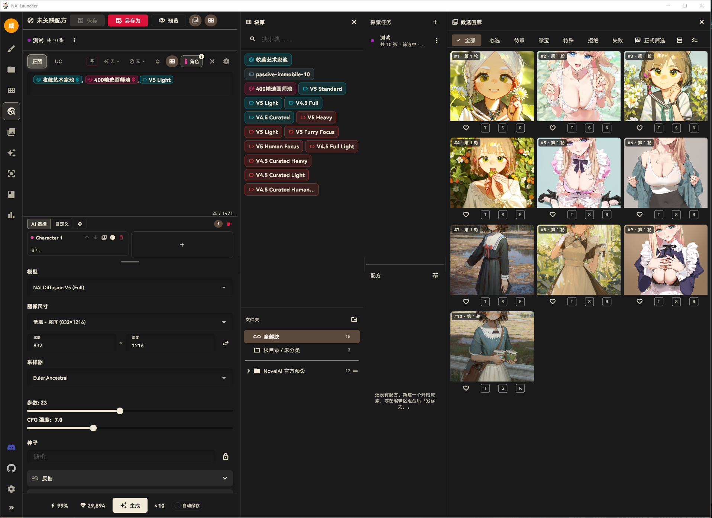
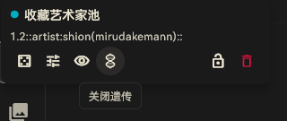
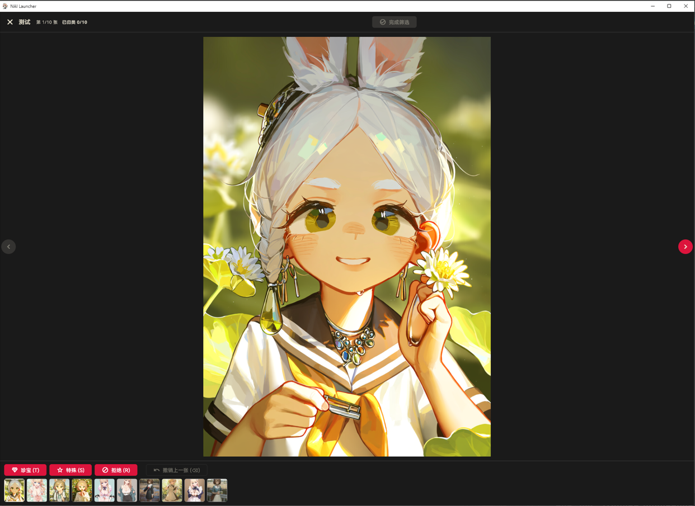
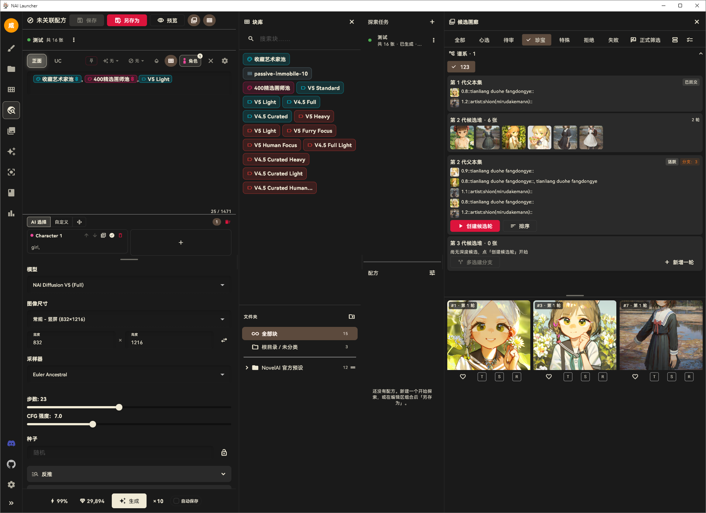
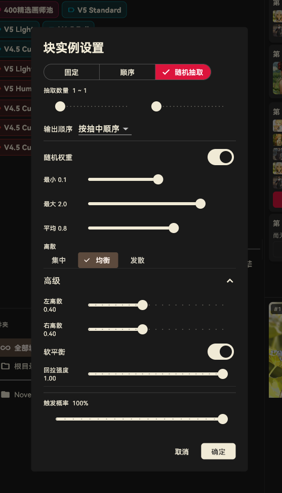

# Style Exploration · Multi-Pool Genetics Tutorial

> [简体中文](style-exploration.md) | English

Style Exploration is a selective-breeding tool for art styles: generate a batch of candidates toward a direction, label them, promote the winners to parents, and let the genetic engine mutate / crossover / inject the next generation — converging round by round onto the style you want. At the end, adopt the winning string as a pill block and use it directly back on the generation page.

Entry: the "Style Exploration" icon in the left navigation rail.

## The flow in 30 seconds

1. **Prepare**: turn artist pools / style strings into blocks, set them to random draw and enable genetics (DNA badge).
2. **Basic round**: create an exploration task, batch-generate dozens of candidates.
3. **Review**: full-screen formal review, label with T / S / R keys.
4. **Deep rounds**: multi-select favorites → "Create Family" → "Create Candidate Round"; offspring mutate automatically.
5. **Iterate**: multi-select the best offspring → "Create Branch"; parents backcross into the next generation.
6. **Harvest**: "Adopt as Block" or "Fixate as Template" — the string flows back into the pill system.

## Interface overview

The page is a three-pane layout with draggable dividers:

- **Left · Recipe & parameters**: the same editor as the generation page (prompt, character boxes, model, size, sampler…). A "recipe" is a named snapshot of prompt + parameters — create / save-as / load / duplicate; unsaved state shows "no linked recipe".
- **Middle · Block library**: the shared block panel; tap a block to insert it into the current prompt.
- **Right · Runs + candidate gallery**: the run list and every candidate of the selected run.

An **exploration task (Run)** freezes the prompt and parameter snapshot, batch-generates candidates, and records each image's roll result. Run lifecycle: draft → generating → generated → reviewing → completed; pause, retry-failed, and cancel are supported (**cancel is irreversible** — remaining pending candidates are marked cancelled).

## Step 0: Make blocks heritable

Genetics works on **block instances**. For a block (e.g. an artist pool) to contribute genes to the mutation pool, two conditions must hold:

1. The instance is **enabled**;
2. Its mode is **random draw** or **sequential** (a "fixed" block never changes — nothing to inherit).

Then a **DNA icon** appears on the pill, toggling "genetics on / off":

> Note: the genetics toggle is **only available on the Style Exploration page** — generation-page pills don't show it, by design, so daily prompting can't accidentally change your genetics setup.

The most common setup: set pool blocks like "Favorite Artist Pool" or "400 Curated Artists" to random draw and enable genetics — they become the engine's gene pool.

## Step 1: Basic round — batch candidates

In the right pane, tap **+** under "Exploration Tasks", name the run, set the **image count**, and start batch generation.

The candidate gallery offers:

- **Grid / deck** views;
- **Multi-select** (for creating families and batch actions);
- Label filters: All / Hearted / Pending / Treasure / Special / Rejected / Failed;
- Per-card **♡ (heart)** and **T / S / R** pre-label buttons;
- A **roll snapshot** per candidate: exactly which strings every random block drew for that image — archived per card, with copy-positive / copy-negative.

## Step 2: Formal review

Tap "**Formal Review**" at the top right of the gallery to enter full-screen labeling:

- Keyboard: **T = Treasure**, **S = Special**, **R = Reject** (buttons at the bottom too);
- "Undo last" fixes mistakes;
- Progress at the top (labeled x / total); "**Complete Review**" is gated until **every candidate is labeled** — every image gets an explicit verdict;
- Completed runs can be re-entered for a **re-review** later;
- Rejected images can be batch-deleted: only the candidate copies inside the Run directory are removed — **source images in your gallery are untouched**.

## Step 3: Deep iteration — lineage & genetics

After review, the genetic loop happens in the "**Lineage**" panel:

### Create a family

**Multi-select** favorite candidates in the gallery and tap "**Create Family**": name the family, preview the parent strings from the selection, and optionally **append a custom string** (type any prompt string as an extra parent). Confirming creates the family + the **1st-generation parent set** (status: active).

### Create candidate rounds (deep rounds)

On the active parent set, tap "**Create Candidate Round**". The mutation engine applies **mutation / crossover / random injection** to the parent strings and produces the next generation:

- The image count is at least the parent count (**every parent is guaranteed at least one child**);
- Prerequisite: the main prompt must contain at least one **enabled, genetics-on** random/sequential block — without a mutation carrier, the engine refuses deep rounds;
- "**Add Round**" appends more candidates to the same generation;
- Deep rounds run on a separate data layer and **never touch your current editor draft**.

### Pairwise parent ranking

Tap "**Sort**" to compare parents pairwise: two strings at a time, answer "left better / right better / neither / skip". A win is preference +1.0, "neither" costs both sides −0.25 (floor 0.25), skip records the pair without scoring. Preference values show on parent entries in the lineage, quantifying which string is closer to the target.

### Multi-select branch creation (next generation)

Multi-select outstanding offspring from the **latest-generation candidate pile** and tap "**Create Branch**": the selected offspring become new parents, and **all 1st-generation parents backcross in** (keeping their preference values), forming the next-generation parent set; the old active set is marked "backcrossed".

Three guardrails (violations are rejected with a reason):

- Offspring can only be picked from the **latest-generation** pile;
- All candidate rounds of the current generation must be **finished** (no pending candidates);
- Deduplicated offspring strings must not **exactly duplicate** the backcross parents.

The lineage panel keeps every generation's parent sets, candidate piles, and branch relations — any offspring's full ancestry is traceable.

## Appendix: random-draw settings in detail

Exploration diversity is governed by each block's random-draw settings. Tap the pill's gear to open "Block Instance Settings":

- **Draw count**: how many entries to draw per generation (a range like 1 ~ 1 means exactly one);
- **Output order**: how multiple draws are ordered;
- **Trigger probability**: chance this instance participates at all (100% = always);
- **Random weights**: drawn entries get `weight::tag::` weights, sampled around the "average" within "min ~ max" (Split-Beta distribution);
- **Dispersion presets**: concentrated / balanced / divergent — pull weights toward the mean or spread them to both ends; "Advanced" exposes left / right dispersion to shape each side of the mean independently;
- **Soft balance + pull-back strength**: shifts the whole string's drawn weights toward the "average weight", damping collective over/under-shooting without changing the relative gaps between members — more stable style intensity across multi-image batches.

Combined with **per-instance lock** (locked instances are excluded from re-rolls) and the **re-roll** button, you control exactly which variables move each round.

## Harvesting results

From a candidate's detail view or the multi-select menu:

- **Adopt as Block**: turn the candidate's roll string into a pill block (name it, or merge-adopt), then insert it anywhere from the generation page / block library;
- **Fixate as Template**: pour the string into the positive prompt, then "Save As" a recipe from the top bar;
- **Roll snapshot**: load the snapshot into the editor to fully restore that image's actual prompt state.

## FAQ

- **"Deep round not possible"**: no enabled random/sequential genetics block in the main prompt. Set at least one block to random draw and light up its DNA icon in the left pane.
- **Branch creation refused**: make sure you selected offspring from the latest-generation pile, all rounds of the current generation are finished, and the offspring strings don't exactly duplicate the backcross parents.
- **Cancelling a run** is permanent; use "Pause" if you just need a break.
- **Deleting candidate images** only removes copies inside the Run directory — gallery sources and favorites stay intact.
- **No DNA icon on the generation page**: the genetics toggle is exclusive to the Style Exploration page, by design.

---

Algorithm design inspired by [monineko/PromptCard-Studio](https://github.com/monineko/PromptCard-Studio) (GPL-3.0); this module is a Dart rewrite that copies no source code. Credits: [THIRD_PARTY_NOTICES.md](../THIRD_PARTY_NOTICES.md).
